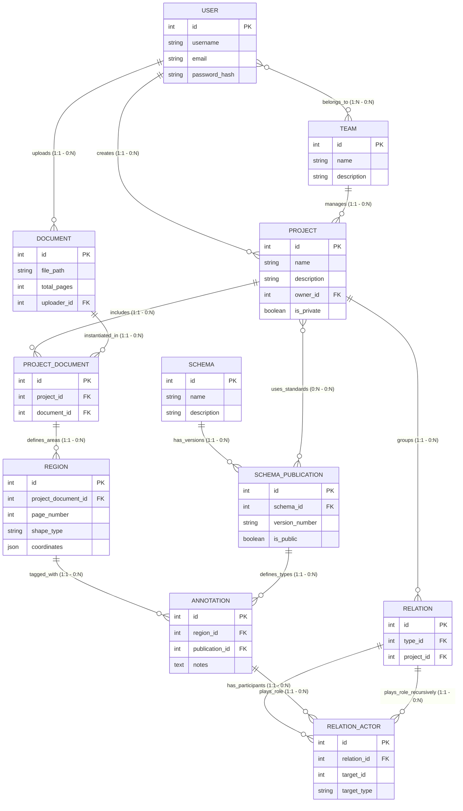

```mermaid
erDiagram
    USER }o--o{ TEAM : "belongs_to (1:N - 0:N)"
    USER ||--o{ PROJECT : "creates (1:1 - 0:N)"
    TEAM ||--o{ PROJECT : "manages (1:1 - 0:N)"
    USER ||--o{ DOCUMENT : "uploads (1:1 - 0:N)"

    PROJECT ||--o{ PROJECT_DOCUMENT : "includes (1:1 - 0:N)"
    DOCUMENT ||--o{ PROJECT_DOCUMENT : "instantiated_in (1:1 - 0:N)"
    
    SCHEMA ||--o{ SCHEMA_PUBLICATION : "has_versions (1:1 - 0:N)"
    PROJECT }o--o{ SCHEMA_PUBLICATION : "uses_standards (0:N - 0:N)"
    
    PROJECT_DOCUMENT ||--o{ REGION : "defines_areas (1:1 - 0:N)"
    
    REGION ||--o{ ANNOTATION : "tagged_with (1:1 - 0:N)"
    SCHEMA_PUBLICATION ||--o{ ANNOTATION : "defines_types (1:1 - 0:N)"
    
    PROJECT ||--o{ RELATION : "groups (1:1 - 0:N)"
    RELATION ||--o{ RELATION_ACTOR : "has_participants (1:1 - 0:N)"
    ANNOTATION ||--o{ RELATION_ACTOR : "plays_role (1:1 - 0:N)"
    RELATION ||--o{ RELATION_ACTOR : "plays_role_recursively (1:1 - 0:N)"

    USER {
        int id PK
        string username
        string email
        string password_hash
    }

    TEAM {
        int id PK
        string name
        string description
    }

    PROJECT {
        int id PK
        string name
        string description
        int owner_id FK
        boolean is_private
    }

    DOCUMENT {
        int id PK
        string file_path
        int total_pages
        int uploader_id FK
    }

    PROJECT_DOCUMENT {
        int id PK
        int project_id FK
        int document_id FK
    }

    SCHEMA {
        int id PK
        string name
        string description
    }

    SCHEMA_PUBLICATION {
        int id PK
        int schema_id FK
        string version_number
        boolean is_public
    }

    REGION {
        int id PK
        int project_document_id FK
        int page_number
        string shape_type
        json coordinates
    }

    ANNOTATION {
        int id PK
        int region_id FK
        int publication_id FK
        text notes
    }

    RELATION {
        int id PK
        int type_id FK
        int project_id FK
    }

    RELATION_ACTOR {
        int id PK
        int relation_id FK
        int target_id
        string target_type
    }
```