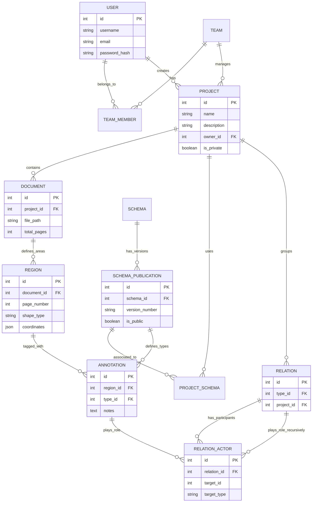

```mermaid
erDiagram
    USER ||--o{ TEAM_MEMBER : belongs_to
    TEAM ||--o{ TEAM_MEMBER : has
    USER ||--o{ PROJECT : creates
    TEAM ||--o{ PROJECT : manages
    
    PROJECT ||--o{ DOCUMENT : contains
    PROJECT ||--o{ PROJECT_SCHEMA : uses
    
    SCHEMA ||--o{ SCHEMA_PUBLICATION : has_versions
    SCHEMA_PUBLICATION ||--o{ PROJECT_SCHEMA : associated_to
    
    DOCUMENT ||--o{ REGION : defines_areas
    
    REGION ||--o{ ANNOTATION : tagged_with
    SCHEMA_PUBLICATION ||--o{ ANNOTATION : defines_types
    
    RELATION ||--o{ RELATION_ACTOR : has_participants
    ANNOTATION ||--o{ RELATION_ACTOR : plays_role
    RELATION ||--o{ RELATION_ACTOR : plays_role_recursively
    
    PROJECT ||--o{ RELATION : groups

    USER {
        int id PK
        string username
        string email
        string password_hash
    }

    PROJECT {
        int id PK
        string name
        string description
        int owner_id FK
        boolean is_private
    }

    DOCUMENT {
        int id PK
        int project_id FK
        string file_path
        int total_pages
    }

    SCHEMA_PUBLICATION {
        int id PK
        int schema_id FK
        string version_number
        boolean is_public
    }

    REGION {
        int id PK
        int document_id FK
        int page_number
        string shape_type
        json coordinates
    }

    ANNOTATION {
        int id PK
        int region_id FK
        int type_id FK
        text notes
    }

    RELATION {
        int id PK
        int type_id FK
        int project_id FK
    }

    RELATION_ACTOR {
        int id PK
        int relation_id FK
        int target_id
        string target_type
    }
```