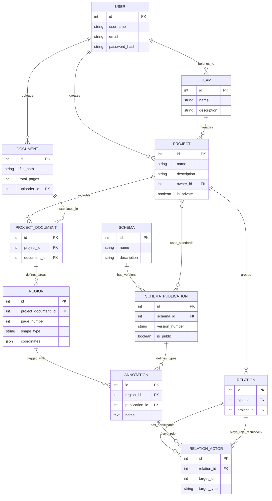

```mermaid
erDiagram
    USER ||--o{ TEAM : belongs_to
    USER ||--o{ PROJECT : creates
    TEAM ||--o{ PROJECT : manages
    USER ||--o{ DOCUMENT : uploads

    PROJECT ||--o{ PROJECT_DOCUMENT : includes
    DOCUMENT ||--o{ PROJECT_DOCUMENT : instantiated_in
    
    SCHEMA ||--o{ SCHEMA_PUBLICATION : has_versions
    PROJECT }o--o{ SCHEMA_PUBLICATION : uses_standards
    
    PROJECT_DOCUMENT ||--o{ REGION : defines_areas
    
    REGION ||--o{ ANNOTATION : tagged_with
    SCHEMA_PUBLICATION ||--o{ ANNOTATION : defines_types
    
    PROJECT ||--o{ RELATION : groups
    RELATION ||--o{ RELATION_ACTOR : has_participants
    ANNOTATION ||--o{ RELATION_ACTOR : plays_role
    RELATION ||--o{ RELATION_ACTOR : plays_role_recursively

    USER {
        int id PK
        string username
        string email
        string password_hash
    }

    TEAM {
        int id PK
        string name
        string description
    }

    PROJECT {
        int id PK
        string name
        string description
        int owner_id FK
        boolean is_private
    }

    DOCUMENT {
        int id PK
        string file_path
        int total_pages
        int uploader_id FK
    }

    PROJECT_DOCUMENT {
        int id PK
        int project_id FK
        int document_id FK
    }

    SCHEMA {
        int id PK
        string name
        string description
    }

    SCHEMA_PUBLICATION {
        int id PK
        int schema_id FK
        string version_number
        boolean is_public
    }

    REGION {
        int id PK
        int project_document_id FK
        int page_number
        string shape_type
        json coordinates
    }

    ANNOTATION {
        int id PK
        int region_id FK
        int publication_id FK
        text notes
    }

    RELATION {
        int id PK
        int type_id FK
        int project_id FK
    }

    RELATION_ACTOR {
        int id PK
        int relation_id FK
        int target_id
        string target_type
    }
```