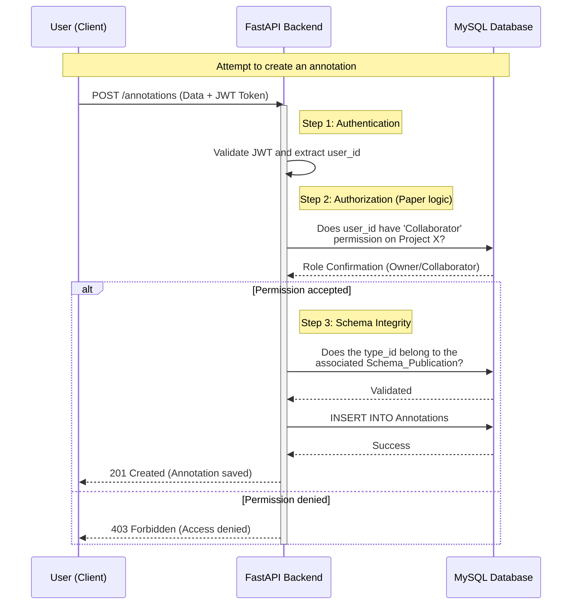

```mermaid
sequenceDiagram
    participant U as User (Client)
    participant API as FastAPI Backend
    participant DB as MySQL Database

    Note over U, DB: Attempt to create an annotation
    U->>API: POST /annotations (Data + JWT Token)
    
    activate API
    Note right of API: Step 1: Authentication
    API->>API: Validate JWT and extract user_id
    
    Note right of API: Step 2: Authorization (Paper logic)
    API->>DB: Does user_id have 'Collaborator' <br> permission on Project X?
    DB-->>API: Role Confirmation (Owner/Collaborator)
    
    alt Permission accepted
        Note right of API: Step 3: Schema Integrity
        API->>DB: Does the type_id belong to the <br/> associated Schema_Publication?
        DB-->>API: Validated
        
        API->>DB: INSERT INTO Annotations
        DB-->>API: Success
        API-->>U: 201 Created (Annotation saved)
    else Permission denied
        API-->>U: 403 Forbidden (Access denied)
    end
    deactivate API
```